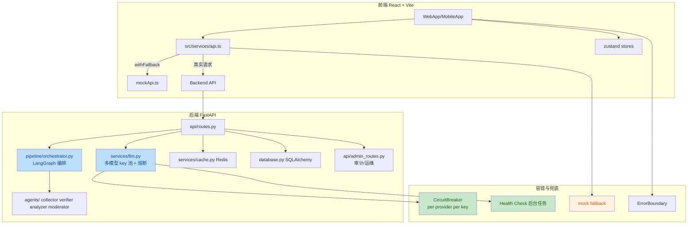

# 观微项目质量审核报告（Trae 创造力大赛参赛作品视角）

# 复赛需要抛光

直接说结论：**以当前状态参加 Trae 创造力大赛，过初赛筛选没问题，但冲击复赛/获奖还需要一轮有针对性的收尾。**

项目最大的优势是**立意和产品完整度**——"AI 驱动的信息验证平台"这个切入点很贴合当下需求，瓜田、求证 Pipeline、AI 竞技场、娱乐大厅、社区、工作间、管理后台模块齐全，后端有多模型 resilience、熔断、健康检查、审计日志等工程化设计，能看出架构思考。

但风险也很明显：**技术债务堆积、部分实现与"稳定优先"的设计目标不一致、前端工程化和测试覆盖薄弱**。评委如果看代码，255 个 Python deprecation warning + 19 个前端 lint warning 会立刻拉低印象分。

---

## 二、质量评分卡

| 维度             | 得分   | 说明                                                         |
| ---------------- | ------ | ------------------------------------------------------------ |
| 产品立意与创新性 | 85/100 | 信息验证 + AI Pipeline + 多Agent编排，差异化明显             |
| 功能完整度       | 80/100 | 前后端模块覆盖广，但部分功能仍依赖 mock/demo 数据            |
| 后端架构设计     | 75/100 | Pipeline 编排、熔断、健康检查到位，但状态持久化和多实例问题未解决 |
| 联调与兜底机制   | 70/100 | mock fallback 完整，但存在前后端不一致和 CORS 风险点         |
| 代码质量与规范   | 60/100 | 后端 warnings 多，前端 lint warnings 未清理，`any` 类型滥用  |
| 测试覆盖         | 55/100 | 后端 57%，前端约 30%，核心组件测试不足                       |
| 安全与隐私       | 65/100 | 有 JWT、CORS 白名单、速率限制，但 API key 暴露、localStorage 存私信等隐患 |
| 部署与工程化     | 65/100 | Docker 配置完整，但无 CI/CD，start-dev.bat 强依赖 Docker     |

---

## 三、架构全景

---

## 四、关键发现（按优先级）

### P0 — 必须修，否则影响评审

| #    | 问题                                                         | 位置                                                         | 影响                                              |
| ---- | ------------------------------------------------------------ | ------------------------------------------------------------ | ------------------------------------------------- |
| 1    | **前端 `callLLM` 仍直接暴露 API Key 调用第三方 LLM**         | [src/stores/llmStore.ts:136-148](file:///d:/code/code/program/4-观微/src/stores/llmStore.ts#L136-L148) | 与 spec-19 后端代理目标矛盾，API Key 在浏览器裸奔 |
| 2    | **搜索 API 测试仍走浏览器直连（CORS/泄露风险）**             | [src/stores/llmStore.ts:101-117](file:///d:/code/code/program/4-观微/src/stores/llmStore.ts#L101-L117) | Tavily/SerpAPI key 同样暴露，且会触发 CORS        |
| 3    | **批量揭瓜不解算积分，与单条揭瓜逻辑不一致**                 | [backend/api/admin_routes.py:403-421](file:///d:/code/code/program/4-观微/backend/api/admin_routes.py#L403-L421) | 数据一致性 bug，批量操作后用户积分/猜中状态错误   |
| 4    | **后台 Pipeline 任务 `asyncio.create_task` 无守护 + 事件回调未注销** | [backend/api/routes.py:197-202](file:///d:/code/code/program/4-观微/backend/api/routes.py#L197-L202) | 任务异常可能静默吞掉，内存泄漏风险                |
| 5    | **TraeBot `messages` 作为 hooks 依赖导致每轮渲染**           | [src/components/TraeBot.tsx:80-131](file:///d:/code/code/program/4-观微/src/components/TraeBot.tsx#L80-L131) | 性能问题，可能触发频繁重渲染                      |

### P1 — 技术债务，建议赛前清理

| #    | 问题                                                 | 位置                                                         | 影响                                    |
| ---- | ---------------------------------------------------- | ------------------------------------------------------------ | --------------------------------------- |
| 6    | **大量 `datetime.utcnow()` 废弃警告**                | 遍布 backend（255 个 warnings）                              | Python 未来版本会移除，显得项目维护性差 |
| 7    | **Pydantic V2 迁移债务**                             | [backend/schemas.py:40-118](file:///d:/code/code/program/4-观微/backend/schemas.py#L40-L118) | `class Config` 和 `from_orm` 已废弃     |
| 8    | **SQLAlchemy 2.0 `declarative_base()` 导入位置废弃** | [backend/database.py:52](file:///d:/code/code/program/4-观微/backend/database.py#L52) | 同上                                    |
| 9    | **FastAPI `@app.on_event` 已废弃**                   | [backend/main.py:61](file:///d:/code/code/program/4-观微/backend/main.py#L61) | 应改为 lifespan                         |
| 10   | **`services/cache.py` 用 `print` 打日志而非 logger** | [backend/services/cache.py:102-141](file:///d:/code/code/program/4-观微/backend/services/cache.py#L102-L141) | 生产环境无法收敛日志                    |
| 11   | **前端 19 个 lint warning 未清理**                   | 多处                                                         | 直接影响代码整洁度印象                  |
| 12   | **`CORS allow_methods=["*"]` 生产环境过宽**          | [backend/main.py:131-132](file:///d:/code/code/program/4-观微/backend/main.py#L131-L132) | 安全最佳实践问题                        |

### P2 — 架构级改进，赛后做

| #    | 问题                                         | 说明                                             |
| ---- | -------------------------------------------- | ------------------------------------------------ |
| 13   | **CircuitBreaker / Pipeline 状态全部内存级** | 多实例部署时不共享，重启后状态丢失               |
| 14   | **LLM 健康检查用真实 API 调用**              | 成本高、可能触发限流，建议改为轻量探测或状态推断 |
| 15   | **前端测试覆盖率约 30%**                     | 核心页面/组件缺乏测试                            |
| 16   | **私信存 localStorage**                      | 与"重视隐私保护"的目标有张力，且 XSS 风险        |
| 17   | **无 CI/CD 和自动化部署**                    | Cloudflare Pages 目前手动部署                    |

---

## 五、后端架构深度点评（你最关注的部分）

### 做得好的地方

1. **LLM 服务层设计扎实**
   - [services/llm.py](file:///d:/code/code/program/4-观微/backend/services/llm.py) 的多 provider key 池轮询、RPM 限流、熔断器、健康检查、主备降级是一整套完整的 resilience 设计。
   - `_call_with_matrix` 的 provider × key 二维遍历思路清晰。

2. **Pipeline 编排有容错意识**
   - [pipeline/commander.py](file:///d:/code/code/program/4-观微/backend/pipeline/commander.py) 包装节点，做重试、热替换、检查点、事件广播。
   - [pipeline/orchestrator.py](file:///d:/code/code/program/4-观微/backend/pipeline/orchestrator.py) 每个节点都有 try/except fallback，避免单点崩溃拖垮整个请求。

3. **管理后台有生产意识**
   - [api/admin_routes.py](file:///d:/code/code/program/4-观微/backend/api/admin_routes.py) 有审计日志、速率限制、CSV 导出、运维监控。

### 需要加强的地方

1. **状态持久化缺失**
   - `MemorySaver` 和内存级 `CircuitBreaker` 在单进程开发时没问题，但参赛作品如果提到"高可用"就会露馅。
   - 建议赛后迁移到 Redis-backed checkpointer 和分布式熔断。

2. **并发和任务管理粗糙**
   - `verify` 接口里 `asyncio.create_task(run_pipeline_background(...))` 是 fire-and-forget，没有任务跟踪、取消、错误兜底。
   - `commander.register_event_callback` 注册的回调在任务结束后没有注销，长期运行可能累积。

3. **批量操作逻辑不一致**
   - `batch_reveal_melons` 只改 `status` 和 `result`，没有结算积分；而 `reveal_melon` 会遍历 `Guess` 更新用户积分。
   - 这是明显的数据一致性 bug。

---

## 六、联调与兜底机制点评

### 做得好的地方

- [src/services/api.ts](file:///d:/code/code/program/4-观微/src/services/api.ts) 的 `withFallback` 设计很用心：首次探测、真实请求失败降级到 mock、业务错误不降级。
- [src/services/mockApi.ts](file:///d:/code/code/program/4-观微/src/services/mockApi.ts) 数据完整，能支撑无后端开发。

### 明显短板

1. **前端仍有直连第三方 API 的通道**
   - `testSearchConnection` 和 `callLLM` 都绕过代理，前面提到的 API key 暴露问题。
   - 这会让"前端安全加固"的叙事自相矛盾。

2. **mock 和真实后端可能 diverge**
   - mock 中的用户、瓜状态、积分逻辑是硬编码的，长期维护容易和真实后端不一致。
   - 建议给 mock 也加简单测试，或在文档中明确哪些接口已有真实实现。

3. **超时策略不匹配**
   - 前端普通请求 timeout 2s，LLM 请求 15s。
   - 后端 Pipeline timeout 120s。
   - 如果用户提交一个复杂求证，前端 15s 就会断掉，但后端还在跑，体验会割裂。

---

## 七、前端工程点评

### 优势

- React 19 + Vite 8 + Tailwind CSS 4 技术栈新。
- [vite.config.ts](file:///d:/code/code/program/4-观微/vite.config.ts) 做了代码分割，manualChunks 避免 vendor 包过大。
- WebLayout 的侧边栏拖拽、折叠交互完整。

### 问题

- **lint warning 19 个未清理**，其中 `react-hooks/exhaustive-deps` 多处，说明 hooks 依赖管理不严谨。
- **`any` 类型滥用**：18 个文件包含 `any`，类型安全形同虚设。
- **测试覆盖低**：只有少量 store 和组件测试，页面级测试几乎没有。
- **部分页面仍依赖 demo 数据**：如 TraeBot 的 `DEMO_SUMMARY`、`DEMO_FACTS`。

---

## 八、参赛竞争力分析

### 你的优势

- **选题好**：信息验证、AI 辟谣是热点，有社会价值。
- **架构有亮点**：多模型 resilience、Agent 编排、熔断降级，这些在参赛项目中属于加分项。
- **功能全**：从前端展示到管理后台到运维监控，覆盖完整链路。
- **文档多**：`.trae/specs/` 里有 20+ 份 spec，说明开发过程规范。

### 评委可能扣分的点

- **代码干净度不够**：255 + 19 个 warning 会给人"匆忙收尾"的感觉。
- **部分实现与宣称不一致**：比如口口声声说 API key 不走浏览器，但 `callLLM` 和搜索测试还在走。
- **测试覆盖不足**：后端 57%、前端 30%，对于强调稳定的作品来说偏低。
- **看不到自动部署/CI**：作品如果只跑在本地，演示风险高。

---

## 九、赛前建议的收尾顺序

按**投入产出比**排序，建议你在提交前做这些事：

1. **修 P0 问题**（半天）
   - 把 `callLLM` 和搜索测试改为后端代理。
   - 修批量揭瓜积分结算。
   - 给后台 Pipeline 任务加错误处理和回调注销。
   - 修 TraeBot hooks 依赖循环。

2. **清理技术债务**（半天到一天）
   - 批量替换 `datetime.utcnow()` → `datetime.now(timezone.utc)`。
   - Pydantic `class Config` → `ConfigDict`。
   - SQLAlchemy `declarative_base()` 导入修复。
   - FastAPI `on_event` → `lifespan`。
   - `services/cache.py` 的 `print` 改 `logger`。
   - 清理前端 19 个 lint warning。

3. **补关键测试**（一天）
   - 前端补核心组件/页面测试，把覆盖率提到 50%+。
   - 后端重点补 pipeline 和 admin_routes 的低覆盖区域。

4. **准备演示脚本**（半天）
   - 确保有一组能稳定跑通的端到端流程（登录 → 发瓜 → 求证 → 揭瓜 → 看报告）。
   - 提前录屏或写好演示路径，避免现场翻车。

5. **部署一个可访问的预览版**
   - 既然没有 Docker，用 `npm run build` + `vite preview` 本地验证后，手动推到 Cloudflare Pages preview。
   - 让评委能直接打开链接，比只提交代码强得多。

---

## 十、一句话总结

**观微是一个有想法、有架构、有完成度的项目，但目前的状态是"骨架很好，血肉还需要修"。** 如果你能在赛前把 P0/P1 的技术债务清掉、把端到端演示跑通，进复赛的概率会高很多。