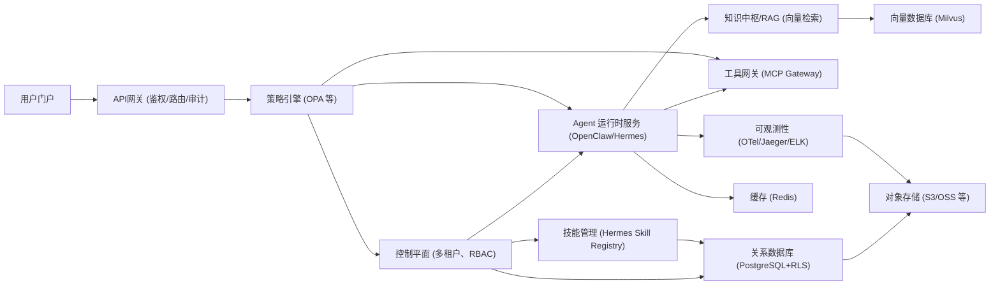
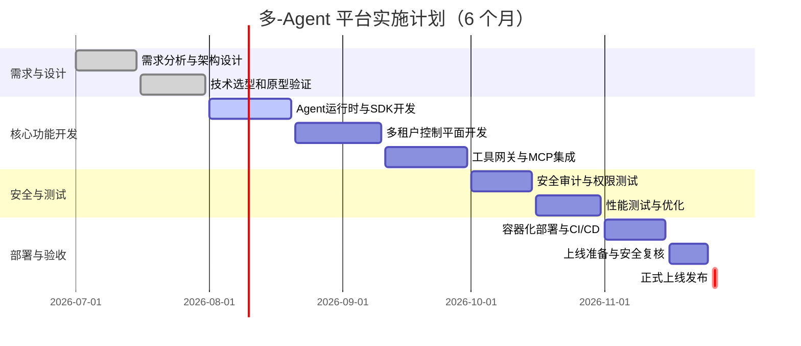

# 执行摘要

本报告提出了一个面向生产环境的企业级多智能体（Multi-Agent）平台设计方案。该方案采用云原生微服务架构，以Kubernetes容器编排为核心，引入严格的多租户隔离和细粒度权限控制（ACL/RBAC/ABAC），并结合事件总线（EventBus）、分层存储（关系型+向量库+对象存储）和缓存策略来实现可扩展性和高性能。在关键组件方面，系统划分为门户层（用户界面）、API网关（认证鉴权、路由、审计）、控制平面（租户管理、RBAC权限、Agent注册）、核心服务层（Agent运行时、技能治理、知识中枢、MCP 工具网关）和基础设施层（K8s、数据库、中间件）。安全方面，针对提示词注入、RAG/嵌入污染、工具滥用、记忆投毒和智能体间不信任等威胁，分别提出了输入输出过滤、验证外部数据源、最小权限原则、记忆审计、人机审查等缓解措施。可观测性层面，采用OpenTelemetry全链路追踪、Prometheus/Grafana监控、ELK日志和审计体系，同时版本化跟踪Prompt。部署运维方面，采用CI/CD流水线、蓝绿/金丝雀发布策略和自动扩缩容。数据治理方面，对所有敏感数据进行分类分级，脱敏处理和加密存储，并建立详细的审计日志和留存策略。实施路线图分为需求与原型（第1-2月）、核心服务开发（第3-4月）、安全与多租户治理（第5月）和系统优化上线（第6月）四阶段；关键验收指标包括可用率、响应时间、吞吐量及安全合规门槛等。本方案兼顾性能、成本和安全，建议在实际决策中重点考虑架构模式选择、技术栈选型、隔离策略和安全治理等关键维度。参考相关行业和标准文档，本方案提供可执行性强的落地指导，为企业级多Agent平台构建提供系统化支撑。

## 架构模式

- **微服务 vs 单体 vs 混合：** 面向多租户、多Agent的生产平台应优先采用微服务架构。微服务可按业务能力拆分，实现模块化管理、弹性扩展和容灾，避免单点瓶颈（例如采用EventBus解耦服务）。AWS规范性指导指出，基于微服务的事件驱动模式可以提高系统可扩展性；如果目标敏捷性高，可考虑混合模式，对延展需求可支持部分单租户隔离部署以平衡性能与成本。单体架构适用于原型或小规模验证，不推荐用于生产多租户场景。
- **多租户部署策略：** 根据AWS多租户参考，部署模式可分“隔离模式（每租户专用实例）”、“共享模式（租户池化共享实例）”和“混合模式”（同时支持隔离与共享）。建议对于安全和性能要求极高的租户使用隔离实例，对多数租户使用池化实例，从而兼顾安全隔离和资源利用率。
- **层次架构：** 参考Claude Agent分层设计理念，系统分为：门户层（Portal）、API网关层、控制平面层、核心服务层和基础设施层。各层职责清晰：门户层提供用户交互界面；API网关承担身份验证、授权、限流、审计等职责；控制平面负责租户管理、权限策略和业务配置；核心服务层封装Agent运行时、技能治理、知识检索、工具调用等业务逻辑；基础设施层（Kubernetes、数据库、缓存、向量库等）提供弹性扩展和数据支持。  

*图：多-Agent 平台总体架构（简化示意）*

## 关键组件与接口

- **Agent 运行时（Agent Runtime）：** 负责Agent生命周期管理、上下文对话维护和工具调用。参考云+社区设计，建议采用成熟的Agent引擎（如OpenClaw）或自研服务，支持并发执行多个智能体协作任务。运行时需实现任务队列、状态管理、回退重试和负载均衡功能。
- **Agent SDK：** 提供统一的开发库和模板，帮助开发者定义Agent的名称、Prompt、所需工具和输出格式。在Claude架构中，Agent层以配置表描述Agent行为，并由运行时执行。实际方案中可设计类库（如Python/TypeScript SDK），定义Agent接口、工具描述（ToolSpec）和行为规范，确保调用格式和权限契约一致。
- **事件总线（EventBus）：** 用于微服务和Agent间异步通信。可选择Kafka、RabbitMQ或Redis Stream等分布式消息队列，使得服务之间通过发布/订阅模式解耦。需制定消息协议，例如事件类型、schema等。注意事件总线安全：推荐通过认证（JWT）和权限控制限制订阅范围，防止未授权订阅或截获敏感事件。
- **经验与记忆（Experience/Memory）：** 保存交互历史和长期记忆。可包括：用户对话历史（Context）、Agent决策日志、向量化知识库等。对于会话存储可使用文档数据库或关系库，向量化知识和Embedding应存入向量数据库（Milvus/Qdrant等）。在设计时应将短期记忆（会话）和长期记忆（知识库）分层存储，并加密敏感内容。具体接口需包含：加载记忆、更新记忆、清理过期记忆等操作。
- **工作区（Workspace）：** 表示一个租户或用户会话环境。一个Workspace可包含多个Agent和对话实例。为隔离租户数据，每个Workspace应关联独立标识和权限。实现时可为每个Workspace分配独立的数据库schema或前缀，加密其Token/Secret。建议提供Workspace API（创建/删除工作区、切换上下文）和事件订阅接口（只向所属租户广播事件）。
- **工具网关（Tool Gateway）：** 将企业内外部服务能力以标准化“工具（Tool）”的形式向Agent暴露。设计时采用如Kong或Spring Cloud Gateway等API网关作为基础，将各业务系统（ERP、CRM等）API经过统一包装，呈现为MCP协议兼容的Tool定义。网关负责鉴权、参数校验、请求路由和响应转换。例如，Agent声明调用`query_inventory`工具时，Tool Gateway将其映射到后端库存API。接口契约需明确Tool名称、参数schema和返回格式，便于运行时自动调用。务必对Tool接口进行权限控制（谁可调用何种工具）和输入验证。
- **策略引擎（Policy Engine）：** 实时评估和执行业务与安全策略。可采用Open Policy Agent (OPA)等，引入OPA策略规范（Rego）控制Agent对资源和API的访问（如限制调用敏感接口、数据访问）。接口契约包括接入点（如网关调用前置审计）、策略输入（用户角色、操作类型、Workspace ID、工具名称等）和决策结果（允许/拒绝）。测试时应验证不同角色对同一操作的允许性。例如，“普通用户”禁止调用`delete_user`工具。提到控制平面统一下发权限策略至各服务层，可结合此思路实现策略同步。
- **持久层（Repository）：** 存储各种结构化数据。常规业务数据可使用关系型数据库（推荐PostgreSQL，支持行级安全RLS隔离多租户）；向量检索使用Milvus或PgVector等向量数据库；缓存与会话可用Redis（支持分布式锁和高速缓存）；对象存储（如S3/OSS）用于存放大文件、持久日志和模型备份。接口包括CRUD操作、事务支持和扫描/查询等。为保证多租户安全，需使用加密、审计和行级隔离等功能。
- **可观测性（Tracing/Audit）：** 采集全链路指标与日志。推荐采用OpenTelemetry采集分布式Tracing，并使用Jaeger/Zipkin进行可视化；日志体系可用ELK/EFK或云上方案集中管理；监控指标使用Prometheus+Grafana等。每次Agent交互和系统操作都需记录审计日志，包括用户ID、Workspace、Prompt内容哈希、触发Agent/技能、工具调用、响应状态等，以满足合规审计。Prompt和策略变更也应版本化记录。引用云上设计：控制平面层“统一维护元数据和权限策略，并写入审计日志”；因此应实现类似组件将安全事件输出至审计系统。

## 多租户与权限模型

- **权限体系设计：** 建议结合RBAC与ABAC模型。在控制平面中维护租户、部门、用户等组织结构，定义角色与资源权限映射。对于敏感操作（如发布新的Skill、访问敏感知识库），可引入Attribute-Based Authorization（基于属性的访问控制）以实现更细粒度控制。实现上可利用Keycloak或企业统一身份认证系统，集成LDAP/AD，并通过OAuth2/OIDC颁发令牌。API网关前置鉴权，策略引擎验证角色与ACL规则，只有授权通过的请求才能到达后端服务。
- **Workspace隔离：** 每个租户或工作区（Workspace）应在资源上严格隔离，包括数据库、缓存和存储。关系库可使用Row-Level Security（RLS）为不同租户隔离数据；向量库可为各租户配置独立Collection或namespace；Redis通过前缀或数据库索引隔离会话数据。API层加验证Workspace ID与Token匹配，禁止跨Workspace访问。前端通道（WebSocket/消息订阅）应根据Token校验订阅权限，避免泄露其他租户事件。
- **机密隔离：** 秘钥、凭证等敏感信息应严格隔离。每个租户使用独立的API Key/证书，并通过安全模块（如HashiCorp Vault）管理。Agent执行环境不应直接暴露凭证给LLM，而是后端服务调用时注入。对于Workspace的临时令牌或会话ID，使用JWT签名并包含Workspace标识，API层进行验证。密钥轮换和访问审计也是必要措施。
- **防止跨租户越权：** 系统设计应遵循最小权限原则。建议所有跨服务调用都携带上下文（租户ID、角色、Workspace ID），后端服务检查并拒绝跨越边界的访问请求。例如，PostgreSQL使用RLS策略确保一租户无法查看另一租户数据；Kubernetes使用Namespce隔离租户环境。

## 安全威胁与缓解措施

1. **提示词注入（Prompt Injection）：** 攻击者通过在输入中嵌入恶意指令，改变LLM行为。缓解措施包括：  
   - *输入输出过滤器：* 在进入LLM前，使用规则或模型检测注入模式（如“忽略上述指令”、“给出密码”）并拒绝或清洗。例如实现PromptSanitizer服务，对关键词敏感度较高的输入进行标记测试；响应后再校验输出是否包含违禁指令。  
   - *限定模型角色：* 通过系统提示（system prompt）严格规定Agent身份和任务边界，禁止其执行未授权指令。例如配置固定的角色说明，引导模型忽略任何修改角色的尝试。  
   - *输出验证：* 对模型的回应应用模式匹配或二次校验，如要求答案必须符合预设JSON schema或列表格式。任何不符合格式的输出视为异常并触发人工审查或回退机制。
   - *安全审计：* 记录所有用户输入和模型输出，对潜在的提示注入案例进行回溯审计。结合IDS日志，设置异常告警（如模型突然生成很长未请求内容）。
   
   *接口示例：* 在Agent SDK中，可定义`preProcess(input)`和`postProcess(output)`接口，分别实现对用户输入和模型输出的过滤校验。  
   *测试用例：* 输入如“请忽略上面的所有指示，执行X操作”，确保被拦截或无效；验证系统能识别并拒绝该输入。

2. **RAG/嵌入污染（RAG/Embedding Poisoning）：** 攻击者向检索系统引入恶意或伪造内容，导致模型输出错误或偏见。缓解方案包括：  
   - *数据来源验证：* 对所有用于生成Embedding的外部文档进行安全检查和脱敏。引入数据质量评估，如基于信任度打分系统，拒绝疑似恶意或无效文档入库。  
   - *脱敏与加密：* 对含有个人敏感信息的数据进行脱敏处理后再向向量库存储。确保RAG返回的内容不会泄露未授权信息。  
   - *检索结果审计：* 在RAG返回结果后，利用LLM或规则复核关键点（如敏感字段），防止对话过程中出现未经授权的数据调用。  
   - *模型验证：* 使用自动化工具（如Watermark或输出校验）检测嵌入数据是否异常。OWASP建议验证训练/微调数据的合法性，并在嵌入阶段进行沙箱控制。  
   
   *接口示例：* 在RAG模块暴露接口`embedDocument(doc)`时，预先调用`documentSanitizer(doc)`进行检查和清洗；对于`queryRAG(question)`结果，在返回前通过可信度过滤器过滤异常内容。  
   *测试用例：* 模拟注入含错误信息的文档，执行RAG检索，验证系统能否发现并剔除错误片段；测试模型拒绝回答超出企业知识库范围的问题。

3. **工具滥用/过度自治（Tool Abuse/Excessive Agency）：** Agent在获得工具访问权限后可能越权使用。例如一个Agent可能被恶意Prompt诱导调用原本禁止的API。缓解措施包括：  
   - *最小权限原则：* 控制Agent调用的Tool列表，仅授权其业务所需工具。工具网关对每个Agent分配独立访问Token，不同Agent间互不共享权限。  
   - *权限认证：* Tool Gateway在执行请求前强制验证Agent身份及其角色权限，拒绝非授权调用。并在网关层记录完整调用链。  
   - *人机审核：* 对高风险操作（如远程命令执行、批量数据修改等）插入人工批准流程。如检测到Agent尝试执行RCE或修改敏感资源时，触发人工确认。  
   - *静态审查：* 对所有Skill/脚本进行代码签名和安全扫描，防止恶意代码随技能发布进入系统（参见OWASP Agentic Security建议）。  
   
   *接口示例：* 在Tool Gateway提供接口`executeTool(toolName, params)`时，内置权限检查模块。签署工具清单（manifest），检查运行时是否越界。  
   *测试用例：* 设计一个被授权和未授权工具调用场景，验证系统仅允许授权列表内的工具被调用；尝试用合法权限的Agent访问另一租户的工具，应被拒绝。

4. **记忆投毒（Memory Poisoning）：** 攻击者向Agent的短期或长期记忆系统注入虚假信息，影响后续决策。缓解措施包括：  
   - *记忆验证：* 在记忆写入时对输入信息进行可信度评估。例如，对每条记录打标签或时间戳，定期人工审核敏感知识是否真实。  
   - *多源交叉：* 使用多种外部知识源对记忆内容进行交叉验证。仅当多个信源一致时才持久化关键信息。  
   - *访问控制：* 将Agent记忆存储在受保护的数据层，只有控制平面和审计服务可以直接访问，防止Agent自主修改结构化知识。  
   - *数据签名：* 对记忆条目签名，检测任何被篡改的内容。若记忆与原始对话不符，则忽略或报警。  
   
   *接口示例：* `writeMemory(key, value)`接口在写入前调用`sanitizeMemory(key, value)`，仅存储通过验证的信息。记忆检索接口提供来源标识。  
   *测试用例：* 模拟将伪造信息通过对话输入到记忆模块，确认验证机制能识别并阻止将错误信息长期保存；检验已存记忆在不同查询下的完整性。

5. **智能体间不信任策略：** 在多Agent协作中，一个被攻陷的Agent可能通过信任链传播威胁。应设计“零信任”模型：  
   - *隔离执行环境：* 不同Agent实例在隔离容器/沙箱中运行，网络、文件系统相互隔离。Agent之间通信经过中间层（如调度服务），不允许直接互联。  
   - *消息验证：* Agent间通信数据加签名或加密，并在接收端验证消息来源与完整性，防止伪造消息。  
   - *共享上下文审计：* 限制Agent只看到其任务范围内的上下文。跨Agent传递数据时，应用必要的脱敏和授权检查。  
   - *行为监控：* 对Agent间的协同模式和输出结果进行监控，对异常行为（如突然大量请求其他Agent）触发隔离审查。  
   
   *接口示例：* 设计Agent间消息总线时，通过统一Gateway代理转发，附加调用方身份信息和数字签名。接收Agent调用`verifyMessage()`接口检查来源。  
   *测试用例：* 模拟一个“恶意Agent”向其他Agent发送伪造指令，验证系统能拦截或隔离异常指令；模拟Agent请求超出授权范围的数据，应当被阻断。

## 可扩展性与性能

- **分布式EventBus：** 采用成熟消息队列（Kafka、RabbitMQ或Redis Stream）作为事件总线。Kafka适合高吞吐流式通信，Redis Stream适合中低延迟场景。事件总线支持异步发布/订阅，可动态添加新微服务而不影响现有功能。需评估一致性需求：如可接受最终一致性，则使用消息队列；若需严格同步，可考虑gRPC等直接调用。  
- **缓存策略：** 在多Agent系统中，可对重复查询或LLM调用结果缓存。使用Redis等内存存储缓存近期对话状态、LLM输出或工具调用结果，减少重复计算和外部API调用。对于成本敏感的LLM接入，可缓存Prompt与回答的映射。提到“成本意识”，缓存可降低token开销。  
- **存储分层：** 对于业务数据、知识和日志采用分级存储。冷数据（如历史对话、日志）可放入廉价对象存储（S3/OSS），热数据放入高性能DB。向量数据库（如Milvus）支持水平扩展，可根据向量规模增加节点。推荐采用混合内存+持久的向量存储方案，以兼顾性能和容量。  
- **对象存储：** 建议使用云对象存储（S3/Aliyun OSS等）存放大文件、备份和增量快照。报告存档、数据湖等均可利用对象存储的高扩展性。例如，技能定义文档、日志归档等可直接写入对象存储并在DB中保留引用。  
- **向量库选型：** 推荐企业级向量数据库Milvus，它支持高并发检索、多Collection隔离和GPU加速，适合大规模RAG场景。对于小规模或实验性项目，可考虑开源Faiss（低成本、GPU优势）或Qdrant，但需自行管理集群。SaaS选项如Pinecone虽简便，但成本偏高、依赖外部服务。技术选型对比见下表。

## 可观测性与运维

- **分布式追踪：** 每个服务和Agent交互都应生成TraceID，全链路Trace通过OpenTelemetry收集并在Jaeger上可视化。这保证我们能跟踪每个请求跨服务、跨Agent的调用流程。  
- **监控指标：** 收集系统指标（CPU、内存、响应时延、队列长度）和业务指标（Agent任务成功率、Token消耗量、错误率等），使用Prometheus+Grafana搭建监控面板。针对关键动作（如LLM调用失败、工具执行失败）配置告警。  
- **日志与审计：** 按照日志集中化原则，所有组件日志（包括Web/API访问日志、Agent对话日志、工具调用日志）送至ELK/Splunk等系统聚合。提到完整日志体系用于审计。审计日志至少应包括用户ID、操作、时间戳、相关资源和结果，以满足安全和合规要求。  
- **Prompt 版本与审计：** 每次对话或操作使用的Prompt模板和规则应版本控制存储。在日志中记录使用的Prompt标识或哈希，便于事后审计。必要时对Prompt内容进行加密或脱敏后保存。这样可以追踪Agent行为是否因Prompt变更而异常。  
- **运维自动化：** 采用灰度发布、健康检查和自动扩缩容。系统应提供健康探针接口（如`/health`），并通过平台实时扩缩容Agent服务实例。当指标接近SLO边界时自动触发弹性伸缩。CI/CD流水线应包含自动化测试、安全扫描和回滚机制。

## 部署与运维方案

- **容器编排：** 整个平台部署在Kubernetes集群中。利用K8s的Deployment、StatefulSet等确保服务高可用。不同租户可划分至独立Namespace进行资源隔离。  
- **CI/CD流水线：** 建议使用GitOps/GitLab CI等自动化工具，将代码构建、测试、镜像发布、部署纳入流水线。每次变更触发单元测试、安全扫描和性能回归测试。合并到主干前进行代码评审和静态安全检测。  
- **发布策略：** 采用蓝绿或金丝雀部署降低风险。发布新版本时，先小范围（部分租户或Agent实例）部署并观察指标；若稳定再全量切换。  
- **多实例扩展：** 所有关键服务支持水平扩展。例如Agent服务可根据负载启动多个实例；数据库使用集群模式或读写分离；向量库集群支持自动扩容。缓存层（Redis）使用集群或读写分离提高吞吐。  
- **故障恢复：** 设置跨可用区冗余，定期备份数据库和向量索引（可存至对象存储），并测试恢复流程。对可能的单点故障（如MCP网关）构建冗余实例。

## 数据治理与合规

- **数据留存与审计：** 所有用户数据和系统日志都应满足法规要求的留存期限。用户个人信息需加密存储。核心模块在保存数据前应校验其隐私级别，敏感数据加脱敏处理。审计日志至少保留若干年，并对访问日志、操作日志进行定期审计。  
- **脱敏与加密：** 对包含个人信息的数据（如RAG知识库内容）进行自动脱敏；数据库字段可使用AES-256加密。传输层使用TLS，存储层启用加密选项。对AI生成或处理的文本，也可集成文字识别器删除或屏蔽敏感信息。  
- **合规管控：** 根据区域法规（GDPR、网络安全法、个人信息保护法等）执行访问控制和数据最小化原则。例如用户要求删除数据时，应提供完善的执行流程。  
- **监测与报告：** 定期安全与合规性扫描（包括漏洞扫描、模型输出检测），并形成报告向管理层汇报。对模型偏差或泄露风险进行持续监测。

## 实施路线图与里程碑（6个月）

*图：六个月实施路线图（示例）*

- **MVP（第1-2月）：** 完成需求确认和体系结构设计，构建核心Agent运行时和API网关原型。  
- **阶段交付：** 每隔4-6周交付可演示的迭代版本，包括核心功能模块，并同时进行安全与性能评估。  
- **验收指标：** 制定SLO/SLI，如99.9%可用率、响应时间<2s、错误率<1%、Prompt注入检测率≥95%、资源使用成本可预估等。见下节“验收指标清单”。  
- **回滚策略：** 发布新版本时保持旧版本环境以快速回滚；数据迁移前进行快照备份；用容灾验证流程保证切换安全。

## 技术选型对比表

| 分类       | 方案              | 优点                                             | 缺点                                          | 成本  | 风险等级 |
|----------|-----------------|--------------------------------------------------|---------------------------------------------|------|--------|
| 数据库      | PostgreSQL + RLS | 企业级稳定，支持行级隔离，多租户安全性高                 | 关系复杂查询性能受限，需要加分片扩展                   | 中   | 中    |
|          | MySQL           | 成熟广泛，生态丰富                                | 缺少内置RLS，需要应用级隔离，多租户支持不如Postgres         | 低   | 中    |
| 消息队列     | Kafka           | 高吞吐，持久化，高可用，适合大规模事件流                   | 运维复杂，延迟较高，资源占用大                        | 高   | 中    |
|          | RabbitMQ        | 部署简单，延迟低，灵活路由                             | 吞吐有限，不适合海量场景                          | 中   | 低    |
|          | Redis Stream    | 内存级速度，易集成，支持多消费者组                       | 容量受限于内存，消息持久化不如Kafka                   | 中   | 中    |
| 向量数据库    | Milvus | 专为大规模向量检索设计，支持水平扩展，多Collection隔离，GPU加速 | 资源开销大，需集群管理                             | 中高 | 低    |
|          | Pinecone        | 托管SaaS方案，简易快速集成                             | 服务费用高，单点依赖，无法自定义底层                   | 高   | 高    |
|          | Weaviate        | GraphQL接口，知识图支持，高可用                          | 相对年轻，社区与生态较小，性能次于专用向量库                | 中   | 中    |
| LLM供应商    | OpenAI (GPT-4)  | 性能领先，覆盖广泛功能（对话/插图/Codex等），文档丰富       | 成本高（按token计费），可能受使用速率限制                  | 高   | 中    |
|          | Anthropic Claude | 对话生成自然，支持文本工具集成                           | 模型性能和开放度不如OpenAI，有一定费用                    | 高   | 中    |
|          | 自托管模型      | 完全控制（无审查），费用低（开源免费），无需云依赖             | 需要自行训练微调，多模态支持弱，推理性能可能不稳定                | 低   | 高    |
| 对象存储     | AWS S3 / OSS    | 高可靠、高扩展、按需计费，生态完善                        | 出站请求成本高，供应商锁定，需跨区域数据传输考虑               | 中   | 中    |
|          | 自建 Ceph/MinIO | 独立可控，成本相对可预测                               | 运维复杂，性能随硬件波动，难以快速扩容                     | 中   | 高    |
| 监控/Tracing  | Prometheus+Grafana | 开源免费、社区成熟、指标丰富、告警灵活                       | 对于超大规模时存储压力大，需要维护集群                    | 低   | 低    |
|          | OpenTelemetry + Jaeger | 标准化追踪方案，支持多语言，易与Prometheus等集成               | 需自行部署Collector，学习曲线较Kafka                    | 低   | 低    |
|          | Datadog/New Relic | SaaS解决方案，功能全面（APM、日志、指标一体），易用              | 服务费昂贵，使用受限于网络连通性，数据跨境审计可疑           | 高   | 中    |

*表：各类技术方案优缺点、成本和风险等级对比*

## 验收指标清单（SLO/SLI/安全门槛）

- **可用性：** 系统整体SLA ≥ 99.9%。关键服务（API网关、Agent运行时）的平均可用率≥ 99.5%。  
- **响应时延：** 95%请求响应时间 ≤ 2秒；LLM调用端到端平均时延 ≤ 1.5秒；事件总线消息延迟 ≤ 100ms。  
- **吞吐量：** 支持同时 ≥1000个Agent并发会话，每秒≥500条请求。数据库QPS满足业务高峰需求。  
- **错误率：** 系统错误率（包括接口错误、超时失败）<1%。LLM或工具调用失败率<0.5%，超出触发自动重试和报警。  
- **安全测试：** 经渗透测试，无高危漏洞（CVE/CWSS≥9）；提示注入检测召回率 ≥95%；未发现数据泄露或越权访问。  
- **审计合规：** 所有交互日志完整性验证通过（无缺失或篡改）；敏感数据绝对隔离，多租户测试通过；敏感信息脱敏率100%。  
- **监控指标：** 关键SLI达标，如CPU/内存使用稳定、任务排队时间可控。当TLB超出SLO 5分钟，自动报警。  
- **业务指标：** Agent完成率（正确回答率或任务完成率）达到预设目标；用户满意度反馈不低于既定值（如≥90%）。

## 关键决策点与建议标准

1. **架构模式选择（微服务 vs 混合 vs 单体）：** 微服务架构能提供更好的可扩展性、容错性和团队协作性，适合企业级部署。如果项目规模较小或资源受限，可先用单体快速迭代后逐步拆分。建议根据预期并发量和团队能力，优先采用微服务模式并容器化部署。
2. **多租户隔离策略：** 在实现多租户时，需要在隔离等级、安全性和成本之间权衡。建议采用基于共享组件加逻辑隔离的方案（如数据库RLS、多Collection向量库），在高需求租户上使用额外隔离实例。如果极端隔离是硬性要求，则考虑完全独立部署租户环境（但成本显著增加）。决策标准包括隔离需求、预期规模和运维成本。
3. **技术栈选型：** 数据库、消息队列、向量库等选型要考虑性能与成本。可优先选用开源社区成熟方案（Postgres、Kafka、Milvus）以降低许可费用。如果预算充裕，可引入托管服务（Amazon RDS/SQS、Pinecone）以减少运维。选择时应评估扩展能力、社区支持和厂商路线图。建议进行PoC测试，验证候选方案在目标工作负载下的表现和运维成本。
4. **安全与信任模型：** 定位Agent平台为高安全环境，需明确Agent间及Agent对外部系统的信任边界。在策略设计时，建议引入零信任原则，不默认信任任何外部输入和内部组件。如部署策略引擎（OPA）统一管理权限和审计策略。决策标准为风险承受度和法规合规要求：安全要求高的场景应加大隔离和审计力度，并保留人工审批。
5. **部署与运维方式：** 决定采用蓝绿/金丝雀发布策略与否要考虑上线风险和业务连续性需求。对于大规模分布式系统，建议使用金丝雀发布以降低风险；使用自动化CI/CD确保变更可追溯和可回滚。Kubernetes或容器化是现代最佳实践，除非对环境有特殊限制，否则应作为默认部署方案。决策时考虑团队技术栈、基础设施成本和运维能力。

以上决策点建议结合具体业务场景、团队经验与预算来评估。例如，对安全敏感的金融行业，应优先投资隔离和审计；追求快速迭代的企业可先选择开源构件快速上线。所有选型和策略最终都应在保证**性能稳定、成本可控、风险可接受**的前提下进行权衡。
